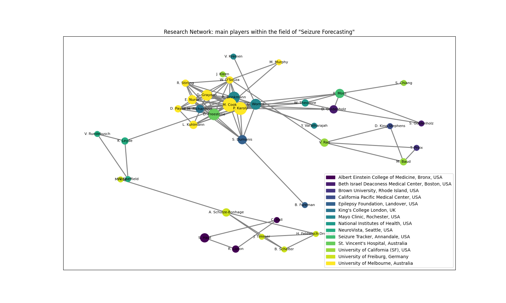

# Network Analytics

## _A visualization tool to help uncover the main players within a research field_

## Why network plots?

Network plots (aka network graphs) provide a visualization of relationships or connections (and their magnitude) between entities. Uses of network plots include:

- Identification of the players within a field, and how they are positioned in comparison to the others
- Visualization of the individual relationships between the players and the magnitude of that relationship

## What we are trying to understand?

In this case, I used network plots to understand who were the main players in the research field of seizure forecast. The main objectives were to answer the following questions:

**Q1:** Who are the most "prolific" authors in the field of seizure forecast?  
**Q2:** Are there specific research groups that have particularly large contributions to the field?
**Q3:** How do authors / research groups collaborate?

## Exploring data

Data collection followed a systematic review

I started on a post by Olivia Tanuwidjaja on [Discovering entity connections insights using Network Analytics][credit], and adapted so that:

- Nodes represent authors;
- Edges represent co-authorship of a paper between two authors;
- The color of a node corresponds to one of the affiliations of the corresponding author;
- The size of a node is proportional to the number of papers the corresponding author has authorship;
- The resulting network can help identify not only research groups, as well as groups that often work together!

#### Q1. Most prolific authors

Since the size of the nodes represents the number of papers co-authored by that author, we can easily identify the most prolific authors, by looking for the largest nodes. In my case, M. Cook (), P. Karoly (), and B. Brinkmann ().

## License

MIT

[credit]: https://towardsdatascience.com/discovering-entity-connections-insights-using-network-analytics-part-2-d445751413b3
